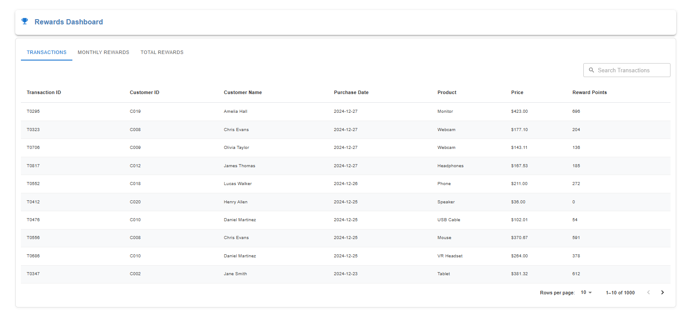
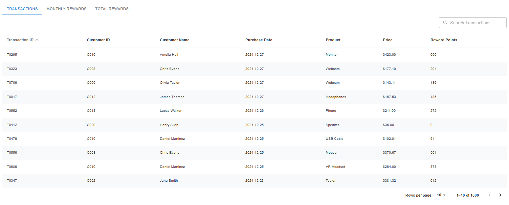
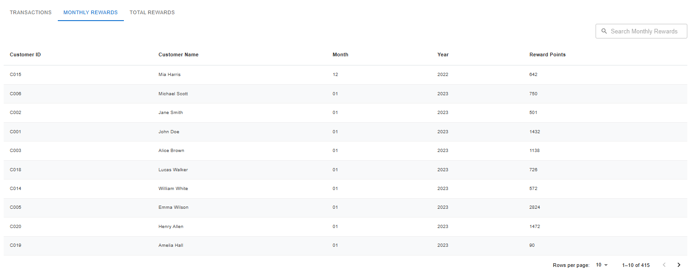
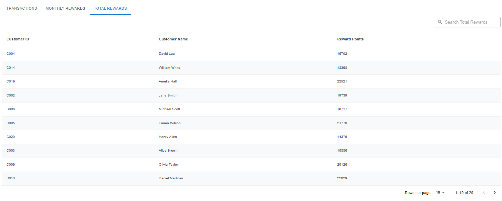
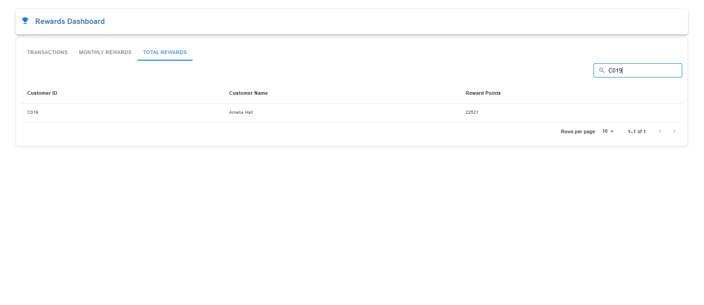
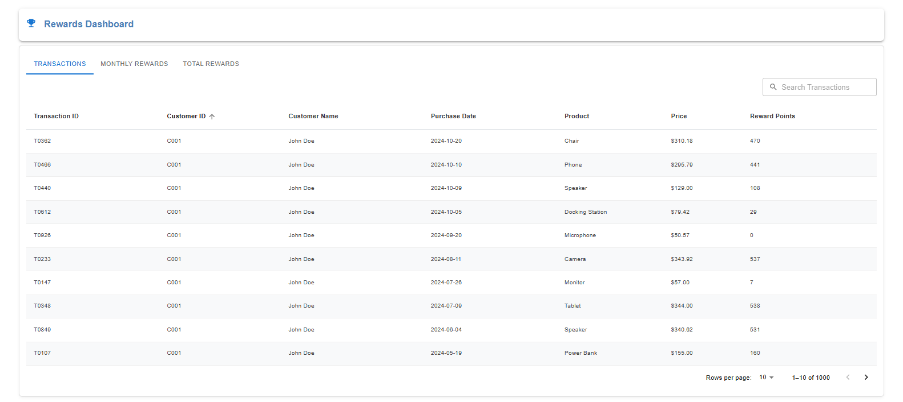
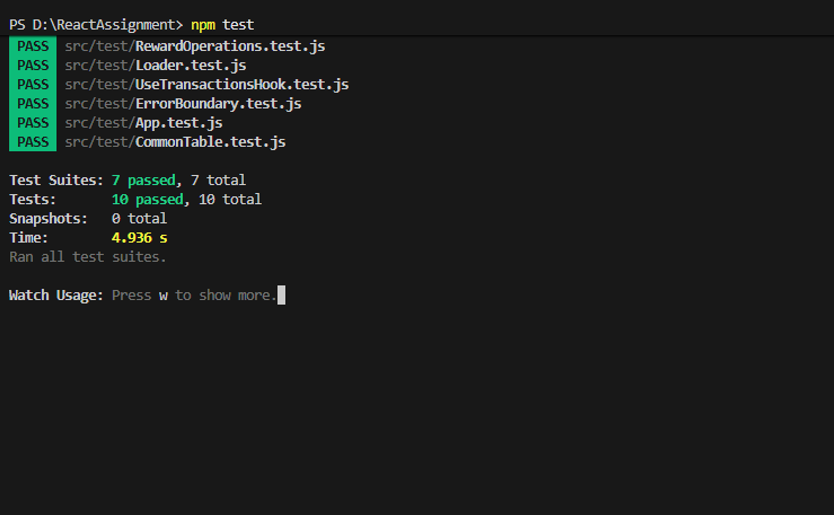
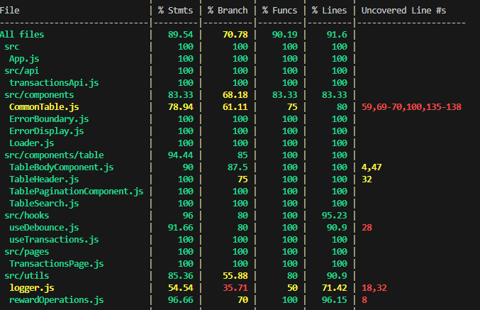

# Rewards Application

## Overview
This project is a React-based Rewards Dashboard designed to track and calculate customer reward points based on transaction history over a three-month period.

Reward Program Rules:

   - Customers earn 2 points for every dollar spent over $100.
   - Customers earn 1 point for every dollar spent between $50 and $100.

The dashboard provides a clear, interactive view of customer spending and corresponding reward points, enabling businesses to better understand and engage their customer base.

## Features
   - View all transactions with calculated reward points
   - Track monthly rewards per customer
   - Track total rewards per customer
   - Search, sort, and paginate data efficiently
   - Responsive UI with Material-UI
   - Performance optimized using useMemo
   - Robust error handling with Error Boundary
   - Comprehensive unit testing with Jest & React Testing Library

## Tech Stack
    - React JS (JavaScript)
    - Material-UI
    - Jest + React Testing Library

## Installation & Setup
    - git clone https://github.com/kalai-vani-p/ReactAssignment.git
    - npm install
    - npm start

## Running Tests
    - npm test

##  Architecture Layers

### 1️ Presentation Layer (UI)
    - Located in components/
    - Responsible for rendering UI
    - Includes reusable components such as:
        - Table components (Header, Body, Pagination, Search)
        - Loader
        - Error display

### 2️ Business Logic Layer
    - Located in utils/
    - Contains pure functions:
        - calculatePoints – Calculates reward points
        - groupByMonths – Aggregates monthly rewards
        - groupByTotal – Aggregates total rewards per customer

### 3️ Data Layer
    - Fetches data from public/transactions.json via API (fetch)
    - Simulates real backend interaction

### 4️ Hooks Layer
    - Located in hooks/
    - Handles reusable logic and state management:
    - useTransactions – Fetches and processes transaction data

### 5️ Error Handling Layer
    - Implemented using ErrorBoundary
    - Prevents application crashes and displays fallback UI

## Approach
    - Used pure functions for business logic (no side effects)
    - Applied separation of concerns (UI, logic, API, hooks)
    - Used useMemo for performance optimization
    - Implemented reusable and modular components
    - Followed clean and scalable folder structure

## Edge Cases Handled
    - Decimal values (e.g., 100.4 → valid reward calculation)
    - Invalid inputs (null, undefined, non-numeric values)
    - Empty dataset handling
    - Multiple customers with overlapping months
    - Invalid API responses
    - Error handling and fallback UI

## Screenshots

### Dashboard

### Transactions 

### Monthly Rewards

### Total Rewards

### Searching

### Sorting

### Error Boundary

### Test Results

### Test Coverage Results

